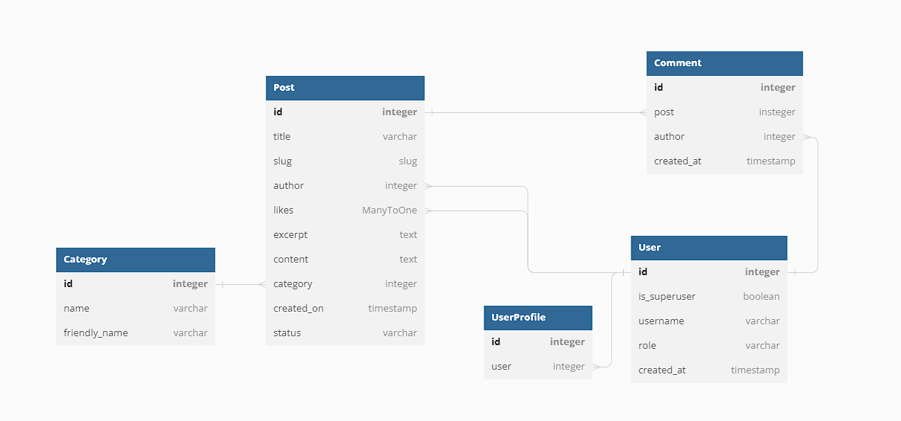

# RTR V5

## Table of Contents

## Description

## Technologies Used

Data modeling - DBSchema

## Planning

Decided for 3*1 week sprints, with some keywords for each sprint in mind  
This plan was made for rtr_v3 originally, so the dates are not exactly matching for this final version.  
Last day of each sprint, i took some time to re-assess next phase based on progress during the previous one, without any major changes.

### Sprint Planning

#### Sprint 1, 12/6-19/6
    * Model setup, Category, Post and Comment
    * Log In/Sign Up functionality
    * Basic READ functionality for users and visitors (posts)
    * Basic Admin setup with CRUD (It's built in to django)
    * Layout and structural front-end design

In sprint 1, i focused mostly on very basic features for users, like:  
    * Setting Up the home view in the form of a postlist-view with sort-functionality by category

In general:  
    * Installing relevant libraries and applications (see requirements.txt for full list)  
    * Structural front-end/layout (No color or decorating)
    * Setting Up admin view to insert model instances for reference when developing the site

#### Sprint 2, 19/6-26/6
    * Model Setup, UserProfile
    * CREATE functionality for users, (posts and comments)
    * Picking a color-scheme
    * Extended admin control (manipulating querysets from the admin-panel in various ways)

#### Sprint 3, 26/6-3/7

## Models

### Model schema

https://dbdiagram.io/d/649b270a02bd1c4a5e274ea3

### Post

### Comment

### UserProfile

## Models

## Design

## Known Issues

## Future Implementation
