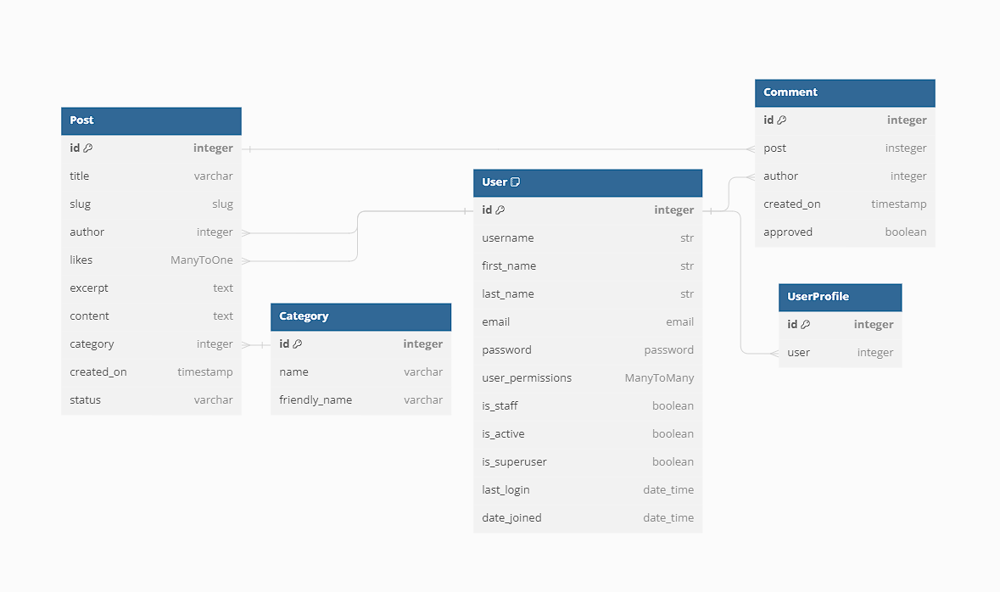
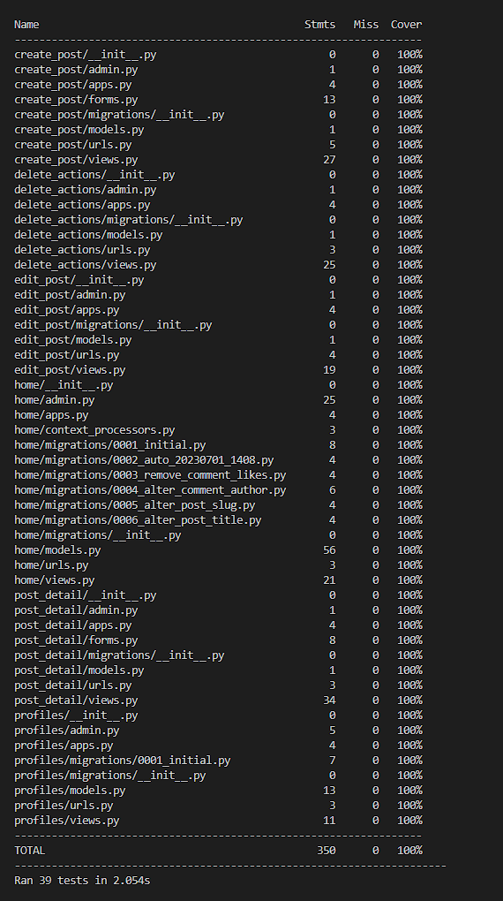
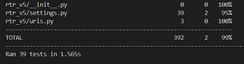
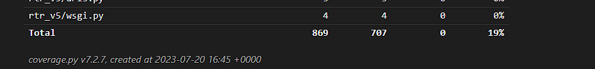
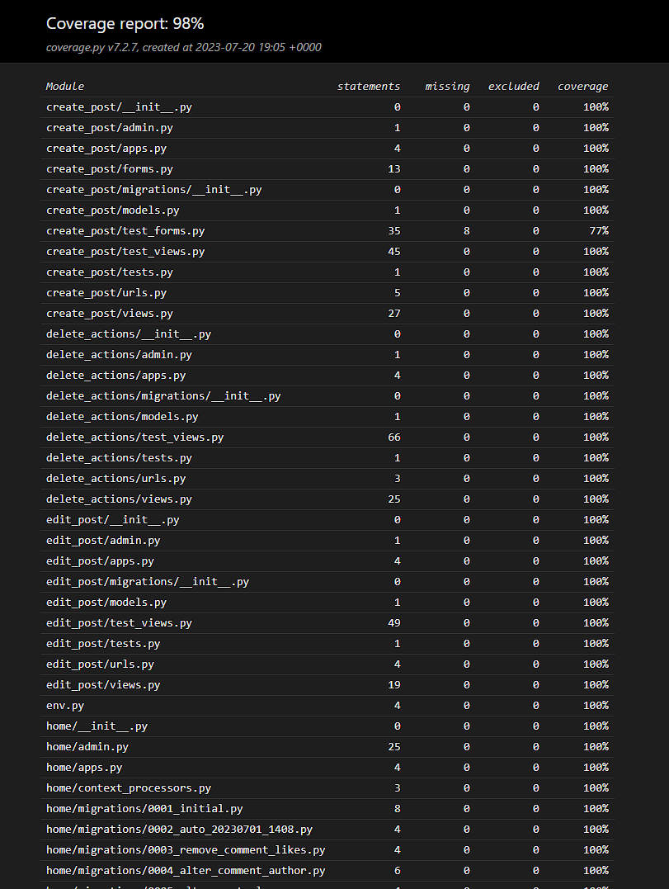
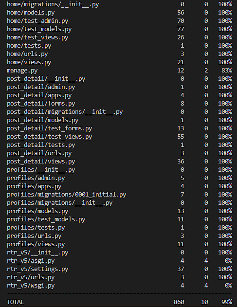

# RTR V5

## Table of Contents

## Description

## Technologies Used

Data modeling - DBSchema

## Planning

Decided for 3*1 week sprints, with some keywords in mind for each sprint  
This plan was made for rtr_v3 originally, so the dates are not exactly matching for this final version.  
Last day of each sprint, i took some time to re-assess next phase based on progress during the previous one, without any major changes.

### Sprint Planning

#### Sprint 1, 12/6-19/6
    * Model setup, Category, Post and Comment
    * Log In/Sign Up functionality
    * Basic READ functionality for users and visitors (posts)
    * Basic Admin setup with CRUD (It's built in to django)
    * Layout and structural front-end design

In sprint 1, i focus mostly on very basic features for users specifically, like:  
    * Setting Up the home view in the form of a postlist-view with sort-functionality by category

General implementations:  
    * Installing relevant libraries and applications (see requirements.txt for full list)  
    * Structural front-end/layout (No color or decorating)
    * Setting Up admin view to insert model instances for reference when developing the site
    * Tests

#### Sprint 2, 19/6-26/6
    * Model Setup, UserProfile
    * CREATE functionality for users, (posts and comments)
    * Picking a color-scheme
    * Extended admin control (manipulating querysets from the admin-panel in various ways)
    * Tests

#### Sprint 3, 26/6-3/7
    * Delete Functionality for users
    * Style templates
    * Tests

### Omitted functionality
Due to time-constraints, i chose to omit the following functionality that was originally planned:
  
* Comment reply system
* News-api, have not recieved a reply about extra requests still

## Models

### Model used and Schema

https://dbdiagram.io/d/649b270a02bd1c4a5e274ea3

Standard Django User Model @ https://docs.djangoproject.com/en/4.2/ref/contrib/auth/

I consider all models to be sourced somewhat from CodeInstitute

## Design

## Testing

### Unit testing

I used 2 different unit test libraries/modules:

* Coverage
* Django Nose

This was because coverage says it wants me to test the test.py files as well,  
I realize i might make a mistake here because i didnt test them,  
but all topics i can find about it says that is not something you should/need to do.  
Also, i wouldnt have a clue where to begin.  
Find results below ->

#### Django Nose overall report

  
Main project report:

#### Django Nose detailed report

However, running coverage in tandem with django nose produces the following 'detailed' overall result:  
  

Did some research about this, and it turns out that coverage and django nose always have been incompatible, there are some ways to 'solve' this, but they are all described as very hacky.

#### Coverage Reports

When you compare the 2, Nose and Coverage does not quite agree on what should be tested:

#### Testing as a user

I started from the homepage and went from there, i took a screenshot on each page to document the navigation process etc.  
On each page, i also refreshed with shift + f5 to make sure there was no issues with cache for example.

Homepage when not logged in:

## Known Issues

## Future Implementation
