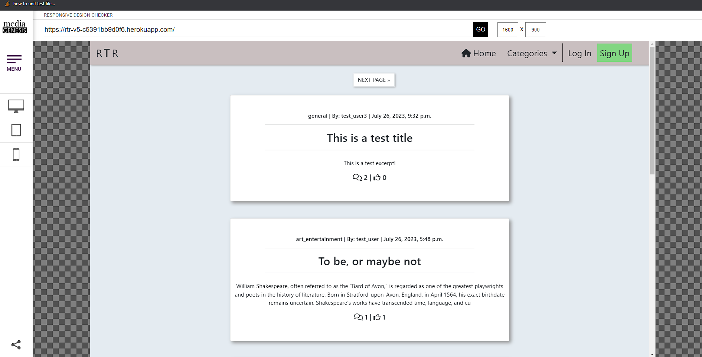
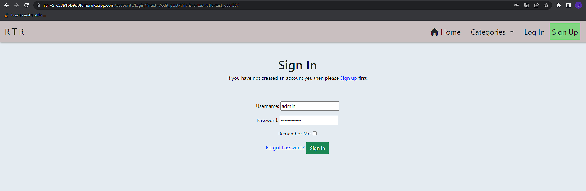

# RTR V5

## Table of Contents

1. [Description](#description)
2. [Technologies Used](#technologies-used)
3. [Planning](#planning)
4. [Models and Schema](#models-used-and-schema)
5. [Design](#design)
6. [Testing](#testing)
7. [Deployment](#deployment)
8. [Known Issues](#known-issues)
9. [Future implementations](#future-implementations)

## Description

Welcome to rtr_v5, This is a reddit-style newspage where users are supposed to be able to share whatever thoughts ideas or news they want.  

### Observe

All posts are made by chatGPT  

## Technologies Used

### Languages, frameworks and libraries

* Python
* HTML
* CSS
* Javascript

* SQL database: ElephantSQL
* Jquery
* Bootstrap

### Planning Tools

* Data modeling - DBSchema
* Kanban: Github

### Installed dependencies (requirements.txt)

* asgiref==3.7.2
* cloudinary==1.33.0
* coverage==7.2.7
* dj-database-url==2.0.0
* dj3-cloudinary-storage==0.0.6
* Django==3.2.19
* django-allauth==0.41.0
* django-nose==1.4.7
* django-summernote==0.8.20.0
* gunicorn==20.1.0
* iniconfig==2.0.0
* nose==1.3.7
* oauthlib==3.2.2
* pluggy==1.2.0
* psycopg2==2.9.6
* pytest==7.4.0
* python3-openid==3.2.0
* pytz==2023.3
* requests-oauthlib==1.3.1
* sqlparse==0.4.4
* urllib3==1.26.16

## Planning

Decided for 3*1 week sprints, with some keywords in mind for each sprint  
This plan was made for rtr_v3 originally, so the dates are not exactly matching for this final version.  
Last day of each sprint, i took some time to re-assess next phase based on progress during the previous one, without any major changes.

### Sprint Planning

See [Kanban Board](https://github.com/users/Enquil/projects/6/views/1 "Kanban Board") for a more detailed view of issues/tasks, it should be public
Including image because i thought it was public the last time as well, it was not.

#### Sprint 1, 12/6-19/6

    * Model setup, Category, Post and Comment
    * Log In/Sign Up functionality
    * Basic READ functionality for users and visitors (posts)
    * Basic Admin setup with CRUD (It's built in to django)
    * Layout and structural front-end design

In sprint 1, i focus mostly on very basic features for users specifically, like:  
    * Setting Up the home view in the form of a postlist-view with sort-functionality by category

General implementations:

* Installing relevant libraries and applications (see requirements.txt for full list)
* Structural front-end/layout (No color or decorating)
* Setting Up admin view to insert model instances for reference when developing the site
* Tests

#### Sprint 2, 19/6-26/6

    * Model Setup, UserProfile
    * CREATE functionality for users, (posts and comments)
    * Picking a color-scheme
    * Extended admin control (manipulating querysets from the admin-panel in various ways)
    * Tests

#### Sprint 3, 26/6-3/7

    * Update and Delete Functionality for users
    * Style templates
    * Tests

### Omitted functionality (Scope)

Due to time-constraints, i chose to omit the following functionality that was originally planned:
  
* Comment reply system (currently only post author can reply to comments)
* News-api, have not recieved a reply about extra requests still
* Removed cloudinary image fields for posts, this is due to switching to function views and i did not have time to learn the differences in how forms are tested

## Models used and Schema

https://dbdiagram.io/d/649b270a02bd1c4a5e274ea3

Standard Django User Model @ https://docs.djangoproject.com/en/4.2/ref/contrib/auth/

I consider all models to be sourced in some way from CodeInstitute, albeit modified to suit my needs.
Exception is the category model.

## Design

Same as with earlier versions, very simple and in your face about what the user can do

### Visual Structure

My only rule for the structure was very simple, everything should be accessible from the navbar and easily understandable.  
The exception are posts and comments which can be found in the actual userprofile.

### Color Scheme

* #e4ebf1, alice blue
  * background
  
* #bde0ff, a darker shade of alice-blue
  * dropdown-items:hover highlighting
  * Posts and Comments 'buttons' in user-profile
  
* #c9bfc0, a reddish version of ghost
  * Navbar
  * Footer
  
* #82d682, light-green
  * Sign Up button

## Testing

### Responsiveness

Responsiveness tests made on [responsivedesignchecker](https://responsivedesignchecker.com/)  
Visit [Responiveness image folder](https://github.com/Enquil/rtr_v5/tree/main/images/responsiveness) for a full detail on responsiveness tests  
Below is the home view tested in small, medium and large screen sizes  

lg  

lg lower  

md  

md lower  

sm  

sm lower  

#### Bugs

During testing, i found that the edit_post template does make a margin/padding on the right side, which leaves a slight gap, i've added it to known issues for now  
This is a md screen test, but it's present on all screens  

### JShint

I used https://jshint.com/ for JavaScript testing  
There are basically 2 functions for the whole site  
One is for putting an overlay when submitting forms, where the only thing changing is the name of the form  
The other one is for messages present in base.html  
Results For each function/view:

#### create_post js

#### edit_post js

#### post_detail_js

#### profiles_js

#### messages_js

### pep-8

I tested all files that i've edited in some way  
Results from https://pep8ci.herokuapp.com/ by app:  

#### create_post

forms.py  
  
test_forms.py  
  
test_views.py  
  
urls.py  
  
views.py  
  

#### delete_actions

test_views.py  
  
urls.py  
  
views.py  
  

#### edit_post

test_views.py  
  
urls.py  
  
views.py  
  

#### home

admin.py  
  
context_processors.py  
  
models.py  
  
test_admin.py  
  
test_models.py  
  
test_views.py  
  
urls.py  
  
views.py  
  

#### main_project (rtr_v5)

settings.py  
  

#### post_detail

forms.py  
  
test_forms.py  
  
test_models.py  
  
test_views.py  
  
urls.py  
  
views.py  
  

#### profiles

admin.py  
  
models.py  
  
test_models.py  
  
urls.py  
  
views.py  
  

### Unit testing

I used 2 different unit test libraries/modules:

* Coverage
* Django Nose

I basically just used 2 because i wanted to compare the libraries  
I did notice a slight difference in how they test for apps

#### Django Nose report

Nose, part 1  
  

Part 2  
  

#### Coverage Reports

Coverage, part 1  

Part 2  

#### W3C validation, HTML

Issues  

* Script is going to be moved into js file once i apply a permanent fix to the multiple form-submit issue
* The div in the ul element stays for now, it doesent break anything and if i wrap it in a li as suggested, it dissappears
* CommentForm in post_detail says it has tables, IT DOES NOT, this seems to be django interference when testing  but im not sure  

Results:  

create_post  
  

edit_post  
  

home  
  

login  
  

post_detail_1  
  

post_detail_2  
  

profile  
  

signup
  

#### W3C validation, CSS

There is an img tag using />, not recommended but does not break anything  
Warnings are all bootstrap  
  

### What the User sees

First, let's visit the deployed site:

Nice, and there's a footer as well

Lets click 'next page and see what happens'

Great, takes us to the next page as expected

Im more interested in specific topic, art and entertainment to be more precise

Great, only 2 posts in here but i can read something at least

Lets click the home button and see what happens

Okay it takes us home, makes sense!
Now, lets click a post:

Okay now i can read the whole thing, but nothing happens when i click the like button.  
Is it broken? Let's let the site owner know by leaving a comment  

Oh okay, seems you cant leave comments without being an account holder
Lets click the sign up button (or in this case, the blue sign up link)

Fill in the form and click, sign up  
(Email is technically not required, but it helps a lot if you would want to enable it later)

Great! We can create users, notice there is an option for us to create posts in the navbar as well as a dropdown with our username  

But first, lets go back to the post and leave a comment

It works! Lets try clicking the like-button as well  
And it works!  

Now lets go and create a post of our own, click the 'create post' button in the navbar  

And fill in the form, excerpt can be left blank, but it's nice to give a preview  

And we have a successful post, and somebody already left us a comment!  
There's a weird button there now, that wasnt present on our own comment that we left  
Lets click it

Okay, seems we can leave replies to users who comment on our posts,  
That button structure is bad, let's add that to issues for now since it's not breaking anything  

And we've left a response, now let's see what that navbar item with our username does  
Seems we have the options to visit our profile, or log out, we're gonna visit the profile  

Alright, looks like we have the option to view some of our previous actions by clicking the related 'button'  

Alright, it shows our post as well as some actions we can take to modify it, lets try and edit it

Okay, the form looks a bit wonky, but at least it's obvious what to do
Notice the use of 2 html linebreaks, the standard textfield supports a limited use of html elements  

Now let's find our post, note that we cant actually access the post from the profile  
This should be fixed, so lets add that to known issues
Let's find the post and leave a comment, adn then back toour profile

Seems we cant edit any comments, but we can delete them in case we made some error, or spoke too soon etc.  
Lets delete the comment we just left on our post  

And it seems to work! Let's also visit the post just to make sure  

And it's gone, now lets see what the 'likes' button does  

It shows a list of the posts that we've liked, and we have the option to visit the post

And here we are, now lets log out and make sure that works properly  

So we get taken to the logout screen  

And we have a successful log out  

### Anonymous and Malicious User Tests

This section is mean to test safeguards when a user tries to take an action or access something they shouldnt be able to  

#### Tests undertaken and expected outcome in order of tests

* Accessing profiles as anonymous user, redirect to login
* Creating a post as anonymous user, redirect to login
* Editing a post as anonymous user, redirect to login
* Editing a post as wrong user, 403 forbidden
* Deleting a post as anonymous user, redirect to login
* Deleting a post as wrong user, 403 forbidden
* Deleting a comment as anonymous user, redirect to login
* Deleting a comment as wrong user, 403 forbidden

Tests were done towards objects created by test_user3, and the malicious user was admin

Results:  

Create Post as anonymous user, cannot produce a 403 since all users can access it  

Redirects as expected  

And we get a successful login  

Edit post as anonymous user  

Redirects as expected  

And a 403 is presented  

Delete post as anonymous user  

Redirect  

Forbidden 403  

Delete comment as anonymous user  

Delete comment redirect  

Forbidden 403  

#### Admin actions

Currently, there are 4 additional actions an admin can take besides deleting models:

* Disable Posts (post should not show up in post_list anymore)
* Publish Posts (post should show up again)
* Disable Comments (So they dont show up on the post again)
* Disable Comments (So they show up on post again)

Let's make sure they work, i used the posts and comments in the user story above  
I used the post made by test_user3 for this  

Unpublish a post, like so  
  

It changes status ok, lets go check it out, the post should be the top one if unsuccessful  
  

And it is not there, great, lets publish it again  
  

Same as above, check any posts you want to 'edit'  
  

Changes status ok  
  

And confirmation  
  

Lets disable the comments on that same post  
  

Appears the boolean changes  
  

The comments still count toward the post, but doesent show up, nice  
(This could be changed to display a placeholder card instead, as an alternative way of handling it)
  

Let's approve them again  

Checks out, lets go visit them  
  

And they're back, nice!  
  

## Deployment

### Step-by-step deployment of live site on Heroku

This will detail the general deployment steps without taking non-essential applications into account

* For this deployment, you will need an account on the following pages:
  * <a href="https://id.heroku.com/login">Heroku</a>
  * <a href="https://www.elephantsql.com/">ElephantSQL</a>
  * <a href="https://cloudinary.com/">Cloudinary</a>

1. run command: pip3 install django, see <a href="https://docs.djangoproject.com/en/4.2/topics/install/">django documentation</a> for info on setting up project and apps.
2. Add installed apps to project settings
3. run command: pip3 install gunicorn
4. run command: pip3 install dj_database_url psycopg2
5. run command: pip3 install dj3-cloudinary-storage
6. run command: python3 manage.py migrate
7. run command: pip3 freeze --local > requirements.txt (run this whenever installing new applications to be used in your project).
8. Log into ElephantSQL, click "new instance", select preferred plan (tiny turtle is free) and give your instance a name.
9. Select the a nearby data-center.
10. Review your selected options and click  'Create instance'.
11. Return to ElephantSQL dashboard, click the database instance name and copy the database URL
12. Go to the Heroku dashboard and create a new app, give the app a name and choose the region that suits you best (Europe for me).
13. Open the SETTINGS tab for your app in Heroku
14. Click Reveal Config Vars
15. Add a Config Var and name it DATABASE_URL, paste the url you copied from ElephantSQL at step 11
16. Add another Config Var and name it SECRET_KEY, you can use <a href="https://djecrety.ir/">Djecretly</a> to generate a new random one.
17. In settings.py, under the line: <strong>from pathlib import Path</strong>, type the following:  
  import os  
  import dj_database_url  
  if os.path.isfile("env.py"):  
    import env  
18. Comment out the DATABASE settings used in settings.py and replace with:  
  DATABASES = {  
   'default':  
  dj_database_url.parse(os.environ.get("DATABASE_  
  URL"))  
  }  
  (Keep the old one in case you need the local environment sqllite settings in the future)  
19. run command: python3 manage.py makemigrations
20. run command: python3 manage.py migrate
21. Go to you Cloudinary dashboard and copy your Cloudinary URL / API Environment Variable.
22. Add another Config Var in you Heroku app named: CLOUDINARY_URL
23. add your cloudinary url to the var, remove any text before 'cloudinary://' in the url
24. In settings.py, in the INSTALLED APPS list, add the following:  
  'cloudinary_storage',  
  'django.contrib.staticfiles',  
  'cloudinary',  
  (order is important here)  
25. In settings.py, under the line: STATIC_URL = '/static/' add the following:  
  STATICFILES_STORAGE = 'cloudinary_storage.storage.StaticHashedCloudinaryStorage'  
  STATICFILES_DIRS = [os.path.join(BASE_DIR, 'static')]  
  STATIC_ROOT = os.path.join(BASE_DIR, 'staticfiles')  
  MEDIA_URL = '/media/'  
  DEFAULT_FILE_STORAGE = 'cloudinary_storage.storage.MediaCloudinaryStorage'  
26. In settings.py, under the BASE_DIR line, add the following:  
  TEMPLATES_DIR = os.path.join(BASE_DIR, 'templates')  
27. In settings.py, find the TEMPLATES list, and add TEMPLATES_DIR to the 'DIRS' list inside
28. In settings, add the Heroku hostname to ALLOWED_HOSTS like this:  
  ALLOWED_HOSTS = ["PROJ_NAME.herokuapp.com", "localhost"]
29. At the top level directory, create these 3 folders: media, static, templates
30. At the top level directory, create a file named Procfile
31. in the Procfile, add the following: web: gunicorn PROJ_NAME.wsgi (replace PROJ_NAME with your project name)
32. Add, Commit and Push the changes to github
33. In Heroku, navigate to your apps 'Deploy' tab and:  
  Select github as deployment  
  At 'App connected to GitHub', Search and find your apps repo, then connect it.
  Scroll down and click 'Deploy Branch' (Main should be selected by default)
34. Wait while the app is building, then click 'View' to make sure it worked
35. Job done

## Known Issues

### W3C test for profiles

It just responded with error messages all the time, think this is because you dont actually use a id or smth in the url, so it doesent really know what to do with that.  
Other views requiring login worked just fine so i will investigate.  

### profile.views.py missing testfile

There is a missing testfile for profile views, i thought it was there since both django nose and coverage considers profiles.views tested.
I also havent omitted any testing manually so im not sure what causes this.  
Suggested course of action:  

* Find out why this is, it's weird that both testing libraries considers this tested
* Add a testfile for profiles views  

### right side margin @ edit_post template

There is a slight margin on the right side of the screen, leaving a gap that doesent look nice.  
I suspect this is connected to why i couldnt get the form to render properly.

### Settings, ALLOWED_HOSTS

Cannot use 'localhost' or the heroku general app-name as allowed hosts, the urls must be specific or django returns an error.  
I need to confirm it's not a chrome problem since it seems to be a problem across all apps i currently have deployed.  
(I think the error started to pop up when google updated their cross-site security some while ago).  

### README, general improvements

While the file content is readable just fine and covers the site, it could do with better navigation at the very least.  
Probably would've been smarter to just link to the pep8 test folder instead of listing every single test, it's very cluttered atm.  

### "Remember me" on forms

The checkbox that lets django remember users seems to not work.  
I thought this was out-of-the-box function but it seems you need to enable it.  
medium-high priority since it does hamper user experience a little bit, if not in a major way.

### Form submitting multiple times (HOTFIX, REPLACE ASAP)

When spam-clicking a form submit button (comment-form specifically), the form submits multiple times  

Temporary Fix: Added a js function to prevent default and put an overlay on top of the page until form is handled.  
This should be switched to a function that disables the button instead, or even straight python could possibly work.
form is replaced by id for relevant form on the corresponding page.  
If a user really wants to bypass this, they can, so this has a really priority to be changed and tested in jest.

### Edit Post Form

Not rendering as expected, should be wider, keeping as is for now, because nothing critical is broken

### Sign-in redirect from comment, anonymous user

When commenting and not logged in, user is not redirected to the post in question  

### No message when trying to comment as anonymous user

It's kinda obvious you cant comment without logging in because of the redirect  
But there still should be a message

### Dismiss modal button

### Cannot access posts directly from profile (FIXED)

You can for the posts you've liked, but ideally you want quick access to you own posts in another way  

It now looks like this:  

## Future Implementations

I chose to sort them by some urgency measure  

* Comment Reply System HIGH
* Post Images, HIGH
* Edit comment view, LOW/MEDIUM, i think twitter/X w/e might've gotten this one right actually
* News API, LOW/MEDIUM
* Financial API, MEDIUM
* User Settings, HIGH
  * Change email, password etc.
* Drafts, this enables more longform posts, for which im aiming at  
* Automated excerpts if user leaves it blank